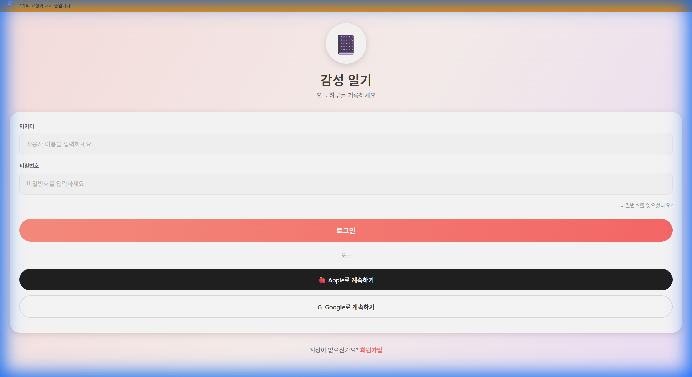
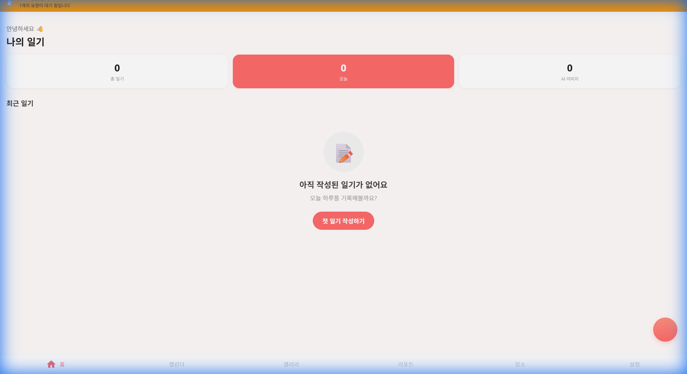
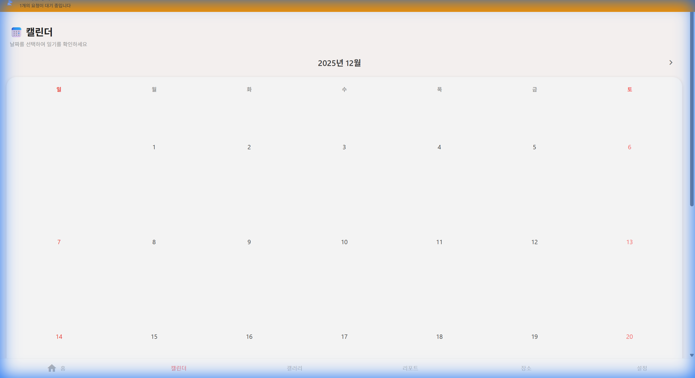
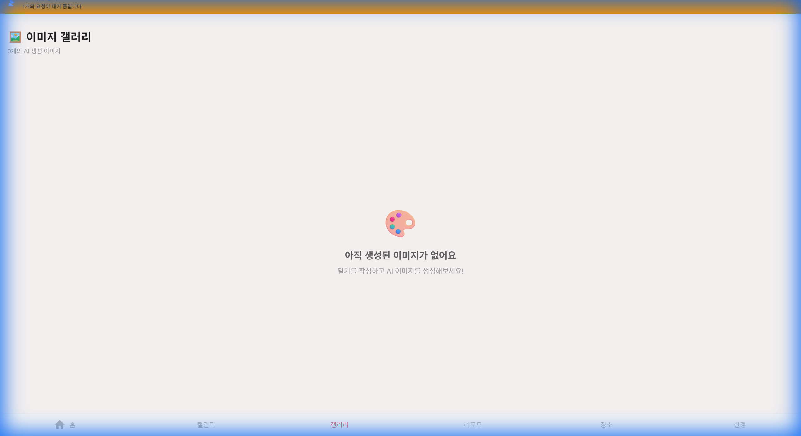

# 📔 감성 일기 (AI Emotion Diary)

> **당신의 하루를 AI가 듣고, 이해하고, 그림으로 그려줍니다.**

사용자가 작성(또는 말한) 일기를 AI가 분석하여 감정을 추출하고, 그날의 기분에 맞는 그림을 그려주는 스마트한 일기장입니다. 웹과 모바일(iOS/Android) 모두를 지원하며, 개인정보는 안전하게 암호화되어 저장됩니다.


---

## 🎬 앱 데모

프로젝트의 주요 기능을 시연하는 데모 영상입니다:

https://github.com/user-attachments/assets/capstone_diary_demo_1768306661087.webp

> **데모 시연 내용:**
> - ✅ 초기 화면: 빈 일기 목록 상태
> - ✅ 일기 작성: "최종 데모 일기" 제목과 내용 입력
> - ✅ 작성 완료: 목록에 새로운 일기가 정상 표시

---

## 📸 앱 스크린샷

| 로그인 | 홈 화면 | 캘린더 |
|:------:|:-------:|:------:|
|  |  |  |

| 갤러리 | 설정 |
|:------:|:----:|
|  |  |

---

## ✨ 주요 기능

### 🧠 AI 감정 분석
- **Gemini 1.5 Flash**를 활용하여 8가지 핵심 감정(행복, 슬픔, 화남, 불안, 평온, 신남, 피곤, 사랑)을 분석
- 문맥을 이해하여 정확한 감정 파악
- 감정 점수(0-100) 제공

### 🎨 AI 그림 생성
- **Gemini Imagen 3**를 기본으로 사용하여 감성적인 이미지 생성
- 결제/오류 발생 시 **DALL-E 3**로 자동 전환 (Fallback)
- 생성된 이미지는 서버에 안전하게 저장 (`media/ai_images/`)

### 🎙️ 음성 일기
- **Whisper API**를 통해 말하는 대로 일기가 작성됩니다
- 100개 이상의 언어 지원
- 실시간 음성 녹음 및 변환

### 📋 일기 템플릿
- **8개의 기본 템플릿**: 오늘 하루, 감사 일기, 목표 일기, 주간 회고, 성장 일기, 감정 일기, 여행 일기, 운동 일기
- **AI 템플릿 생성**: 원하는 주제로 맞춤 템플릿 자동 생성
- **플레이스홀더**: `{{날짜}}`, `{{요일}}` 등 자동 치환

### ✨ AI 요약 & 제목 제안
- **Gemini 1.5 Flash**를 활용하여 일기 내용을 3줄/1줄/불릿으로 요약
- 일기 제목 자동 제안 (3가지 스타일)

### 🧠 고급 AI 알고리즘
- **🔑 스마트 키워드 추출 (KeyBERT)**: 단순 빈도수가 아닌 문맥 기반 핵심 태그 추출
- **🧠 유사 기억 연상 (Vector Search)**: `pgvector`를 활용해 현재 일기와 감정/내용이 비슷한 과거의 기억 추천

### 📊 감정 리포트 & 히트맵
- **주간/월간/연간 리포트**: 감정 변화 통계 및 그래프
- **GitHub 잔디 스타일 히트맵**: 연간 일기 작성 및 감정 시각화
- **연속 작성일**: 현재/최장 스트릭 추적

### 🏷️ 태그 & 검색
- 다중 태그로 일기 분류 (커스텀 색상 지원)
- 키워드, 기간, 감정, 태그로 검색

### 📍 위치 기반 일기
- GPS를 통한 현재 위치 자동 감지
- 프리셋 장소 (집, 회사, 카페 등)
- 지도에서 일기 위치 시각화

### 🔐 프라이버시 & 보안
- 모든 일기 내용 **AES-256 (Fernet)** 암호화
- **JWT 기반 인증** (Access + Refresh 토큰)
- **이메일 인증** 필수 (24시간 내 미인증 계정 자동 삭제)
- **Rate Limiting**: 브루트포스 및 DDoS 방어

### 📱 크로스 플랫폼
- **React Native (Expo)** 기반으로 웹, iOS, Android 지원
- 다크 모드 / 라이트 모드 / 시스템 모드 지원
- 다크 모드 / 라이트 모드 / 시스템 모드 지원

### 📶 오프라인 우선 설계 (Offline-First)
- **끊기지 않는 경험**: 네트워크 연결이 없어도 일기 작성, 수정, 조회가 가능합니다.
- **동기화 큐**: 변경 사항은 로컬에 저장되었다가 온라인 상태가 되면 자동으로 서버와 동기화됩니다.
- **충돌 해결**: 서버 데이터와 버전 충돌 시 스마트한 병합 전략을 사용합니다.
- > 자세한 동기화 전략은 [OFFLINE_SYNC_STRATEGY.md](docs/OFFLINE_SYNC_STRATEGY.md)에서 확인할 수 있습니다.

---

## 🛠️ 기술 스택

| 구분 | 기술 | 버전 | 설명 |
|------|------|------|------|
| **Frontend** | React Native (Expo) | SDK 52 | 크로스 플랫폼 앱 개발 |
| | TypeScript | 5.x | 정적 타입 지원 |
| | Expo Router | 4.x | 파일 기반 라우팅 |
| **Backend** | Django | 6.0 | Python 웹 프레임워크 |
| | Django REST Framework | 3.x | RESTful API |
| | SQLite (개발) / PostgreSQL (배포) | - | 데이터베이스 |
| | pgvector | - | 벡터 유사도 검색 |
| **AI Models** | Gemini 1.5 Flash | - | 감정 분석, 템플릿 생성, 일기 요약 |
| | Gemini 1.5 Flash | - | 일기 요약 |
| | Imagen 3 | - | 이미지 생성 (Primary) |
| | DALL-E 3 | - | 이미지 생성 (Fallback) |
| | Whisper-1 | - | 음성 인식 (100+ 언어) |
| **Security** | AES-256 (Fernet) | - | 일기 내용 암호화 |
| | JWT (SimpleJWT) | - | 사용자 인증 |
| | Rate Limiting | - | API 요청 제한 |
| **Monitoring** | Sentry | - | 에러 추적 |
| **Infra** | Docker | - | 컨테이너화 |
| | GitHub Actions | - | CI/CD |
| | drf-yasg | - | Swagger/OpenAPI 문서 |

---

## 🏗️ 시스템 아키텍처 (System Architecture)

이 프로젝트는 확장성과 유지보수성을 고려한 모던 아키텍처로 설계되었습니다.

> 상세 설계 문서는 [SYSTEM_ARCHITECTURE.md](docs/SYSTEM_ARCHITECTURE.md)에서 확인할 수 있습니다.

- **Frontend**: React Native (Expo) + Offline Queue + Optimistic UI
- **Backend**: Django REST Framework (Layered Architecture)
- **Async Processing**: Celery + Redis (AI 분석 및 이메일 전송 비동기 처리)
- **Data Layer**: PostgreSQL + pgvector (벡터 검색을 통한 유사 일기 추천)

---

## 🚀 시작하기

### 사전 요구사항
- Node.js (v18 이상)
- Python (3.12 이상)
- OpenAI API Key (음성 녹음 및 Fallback 사용 시)

### 1. 저장소 클론
```bash
git clone https://github.com/kimmyuung/capstone-diary.git
cd capstone-diary
```

### 2. Backend 설정
```bash
cd backend

# 가상환경 생성 및 실행
python -m venv venv
.\venv\Scripts\activate  # Windows
# source venv/bin/activate  # Mac/Linux

# 의존성 설치
pip install -r requirements.txt

# .env 설정
cp .env.example .env
# .env 파일에 다음 값 입력:
# - SECRET_KEY: Django 비밀 키
# - GEMINI_API_KEY: Google Gemini API 키 (필수 - 요약/이미지)
# - OPENAI_API_KEY: OpenAI API 키 (선택 - Fallback/감정분석)
# - DIARY_ENCRYPTION_KEY: 일기 암호화 키

# DB 마이그레이션
python manage.py migrate

# 시스템 템플릿 생성 (선택)
python manage.py create_system_templates

# 서버 실행
python manage.py runserver
```
서버: `http://localhost:8000`

### 3. Frontend 설정
```bash
cd frontend

# 의존성 설치
npm install

# 앱 실행
npx expo start --web    # 웹
npx expo start --ios    # iOS 시뮬레이터
npx expo start --android # Android 에뮬레이터
```
웹: `http://localhost:8081`

### 4. 테스트 계정 생성 (개발용)
```bash
cd backend
python manage.py shell -c "from django.contrib.auth.models import User; User.objects.create_user('devtest', 'devtest@test.com', 'devtest123', is_active=True)"
```

---

## 📡 API 엔드포인트

### 인증 (9)
| Method | Endpoint | Description |
|--------|----------|-------------|
| POST | `/api/register/` | 회원가입 (이메일 인증 필요) |
| POST | `/api/token/` | 로그인 (JWT) |
| POST | `/api/token/refresh/` | 토큰 갱신 |
| POST | `/api/email/verify/` | 이메일 인증 코드 확인 |
| POST | `/api/email/resend/` | 인증 코드 재전송 |
| POST | `/api/password/reset-request/` | 비밀번호 재설정 요청 |
| POST | `/api/password/reset-confirm/` | 비밀번호 재설정 확인 |
| POST | `/api/username/find/` | 아이디 찾기 |
| POST | `/api/auth/google/` | Google 소셜 로그인 |
| POST | `/api/auth/kakao/` | Kakao 소셜 로그인 |

### 일기 (12)
| Method | Endpoint | Description |
|--------|----------|-------------|
| GET/POST | `/api/diaries/` | 일기 목록/작성 |
| GET/PUT/DELETE | `/api/diaries/{id}/` | 일기 상세/수정/삭제 |
| GET | `/api/diaries/report/` | 감정 리포트 (주간/월간/연간) |
| GET | `/api/diaries/calendar/` | 캘린더 데이터 |
| GET | `/api/diaries/heatmap/` | 연간 감정 히트맵 |
| GET | `/api/diaries/gallery/` | AI 이미지 갤러리 |
| GET | `/api/diaries/locations/` | 위치별 일기 목록 |
| GET | `/api/diaries/{id}/similar/` | 유사 일기 추천 (Vector Search) |
| POST | `/api/diaries/{id}/generate-image/` | AI 이미지 생성 |

### 태그 (5)
| Method | Endpoint | Description |
|--------|----------|-------------|
| GET/POST | `/api/tags/` | 태그 목록/생성 |
| GET/PUT/DELETE | `/api/tags/{id}/` | 태그 상세/수정/삭제 |
| GET | `/api/tags/popular/` | 인기 태그 |

### 템플릿 (8)
| Method | Endpoint | Description |
|--------|----------|-------------|
| GET/POST | `/api/templates/` | 템플릿 목록/생성 |
| GET | `/api/templates/system/` | 시스템 템플릿 |
| GET | `/api/templates/my/` | 내 템플릿 |
| POST | `/api/templates/{id}/use/` | 템플릿 사용 |
| POST | `/api/templates/generate/` | AI 템플릿 생성 |
| POST | `/api/templates/save-generated/` | 생성된 템플릿 저장 |

### AI & 음성 (6)
| Method | Endpoint | Description |
|--------|----------|-------------|
| POST | `/api/summarize/` | AI 일기 요약 |
| POST | `/api/suggest-title/` | 제목 제안 |
| POST | `/api/transcribe/` | 음성 → 텍스트 |
| POST | `/api/translate-audio/` | 음성 번역 (영어로) |
| GET | `/api/supported-languages/` | 지원 언어 목록 |

### 설정 & 기타 (6)
| Method | Endpoint | Description |
|--------|----------|-------------|
| GET/PATCH | `/api/preferences/` | 사용자 설정 |
| GET/PUT | `/api/preferences/theme/` | 테마 설정 |
| POST | `/api/push-token/` | 푸시 토큰 등록 |
| GET | `/api/health/` | 헬스 체크 |

### API 문서
- **Swagger UI**: `http://localhost:8000/api/docs/`
- **ReDoc**: `http://localhost:8000/api/redoc/`
- **JSON**: `http://localhost:8000/api/docs.json`

---

## 📊 프로젝트 구조

```
capstone-diary/
├── backend/                    # Django REST API
│   ├── config/                 # 프로젝트 설정
│   │   ├── settings.py         # Django 설정 (캐시, 보안 등)
│   │   ├── urls.py             # URL 라우팅
│   │   ├── throttling.py       # Rate Limiting 설정
│   │   └── exception_handler.py # 커스텀 예외 처리
│   ├── diary/                  # 메인 앱
│   │   ├── models/             # 모델 (도메인별 분리)
│   │   │   ├── diary.py        # Diary, DiaryImage
│   │   │   ├── tag.py          # Tag, DiaryTag
│   │   │   ├── template.py     # DiaryTemplate
│   │   │   ├── preference.py   # UserPreference
│   │   │   ├── auth_tokens.py  # 인증 토큰
│   │   │   └── push.py         # PushToken
│   │   ├── views/              # 뷰 모듈
│   │   │   ├── auth_views.py   # 인증 (회원가입, 로그인 등)
│   │   │   ├── diary_views.py  # 일기 CRUD
│   │   │   ├── tag_views.py    # 태그 관리
│   │   │   ├── template_views.py # 템플릿
│   │   │   ├── ai_views.py     # AI 요약/제목
│   │   │   ├── speech_views.py # 음성 인식
│   │   │   └── ...
│   │   ├── services/
│   │   │   └── chat_service.py     # AI 채팅 서비스
│   │   ├── ai_service.py       # AI 서비스 (Gemini, Fallback, Whisper)
│   │   ├── emotion_service.py  # 감정 분석 (GPT)
│   │   ├── push_service.py     # 푸시 알림
│   │   ├── encryption.py       # AES-256 암호화
│   │   ├── messages.py         # 다국어 메시지
│   │   └── tests/              # 단위 테스트
│   └── requirements.txt
│
├── frontend/                   # React Native (Expo)
│   ├── app/                    # 화면 (Expo Router)
│   │   ├── (tabs)/             # 탭 네비게이션
│   │   │   ├── index.tsx       # 홈
│   │   │   ├── calendar.tsx    # 캘린더
│   │   │   ├── gallery.tsx     # 갤러리
│   │   │   ├── reports.tsx     # 리포트
│   │   │   ├── places.tsx      # 장소
│   │   │   └── settings.tsx    # 설정
│   │   ├── diary/              # 일기 관련 화면
│   │   │   ├── create.tsx      # 일기 작성
│   │   │   ├── [id].tsx        # 일기 상세
│   │   │   └── edit/[id].tsx   # 일기 수정
│   │   ├── login.tsx           # 로그인
│   │   ├── register.tsx        # 회원가입
│   │   └── forgot-password.tsx # 비밀번호 찾기
│   ├── components/             # 컴포넌트
│   │   ├── DiaryForm.tsx       # 일기 작성 폼
│   │   ├── EmotionHeatmap.tsx  # 감정 히트맵
│   │   ├── TagSelector.tsx     # 태그 선택
│   │   ├── TemplateSelector.tsx # 템플릿 선택
│   │   ├── LocationPicker.tsx  # 위치 선택
│   │   ├── VoiceRecorder.tsx   # 음성 녹음
│   │   └── OfflineBanner.tsx   # 오프라인 알림
│   ├── contexts/
│   │   └── AuthContext.tsx     # 인증 상태 관리
│   ├── hooks/                  # 커스텀 훅
│   │   ├── useNetworkStatus.ts # 네트워크 상태
│   │   ├── useLocation.ts      # GPS 위치
│   │   └── useFormErrors.ts    # 폼 에러 처리
│   ├── services/
│   │   ├── api.ts              # API 클라이언트
│   │   └── offlineQueue.ts     # 오프라인 큐
│   ├── constants/
│   │   └── theme.ts            # 디자인 시스템
│   └── __tests__/              # 테스트
│
├── .github/
│   └── workflows/
│       └── ci.yml              # GitHub Actions CI
│
└── README.md
```

---

## 🧪 테스트

### Backend 테스트
```bash
cd backend
python manage.py test
```

### Frontend 테스트
```bash
cd frontend
npm test
```

### E2E 테스트 (Playwright)
```bash
cd frontend
npx playwright test
```

---

## 📊 개발 로드맵

- [x] **Phase 1**: MVP (일기 CRUD, 기본 감정 분석)
- [x] **Phase 2**: AI 고도화 (Gemini 1.5 Flash, Imagen 3, Whisper)
- [x] **Phase 3**: 사용자 경험 (리포트, 음성 입력, UI 개선)
- [x] **Phase 4**: 태그, 템플릿, AI 생성
- [x] **Phase 5**: 히트맵, 설정 동기화, Rate Limiting
- [x] **Phase 6**: 모노레포 통합, Swagger 문서화
- [x] **Phase 7**: 이메일 인증, 소셜 로그인, 보안 강화
- [x] **Phase 8**: 위치 기반 기능, 오프라인 모드
- [x] **Phase 9**: 배포 (Docker, AWS/GCP, CI/CD)

---

### 5. 배포 (Deployment)

AWS EC2 및 Docker 기반의 실서비스 배포를 완벽하게 지원합니다.

> 자세한 배포 가이드는 [DEPLOYMENT.md](backend/docs/DEPLOYMENT.md)를 참고하세요.

- **Docker Compose**: 원클릭 컨테이너 실행 및 관리
- **SSL/TLS**: Let's Encrypt를 통한 HTTPS 자동 인증서 발급 및 갱신
- **CI/CD**: GitHub Actions를 통한 자동 테스트 및 배포 파이프라인
- **Monitoring**: Sentry 연동을 통한 실시간 에러 추적

---

## 🔧 환경 변수

### Backend (.env)
```bash
# Django 설정
SECRET_KEY=your-secret-key
DEBUG=True

# Google Gemini API (필수 - 요약/이미지)
GEMINI_API_KEY=AIza...

# OpenAI API (선택 - Fallback/감정분석)
OPENAI_API_KEY=sk-your-openai-api-key

# 일기 암호화 키 (필수)
# 생성: python -c "from cryptography.fernet import Fernet; print(Fernet.generate_key().decode())"
DIARY_ENCRYPTION_KEY=your-encryption-key

# 이메일 설정 (선택)
EMAIL_HOST=smtp.gmail.com
EMAIL_HOST_USER=your-email@gmail.com
EMAIL_HOST_PASSWORD=your-app-password

# Sentry (선택)
SENTRY_DSN=your-sentry-dsn
```

---

## ❓ 자주 묻는 질문 (FAQ) & 문제 해결

**Q. 서버 실행 시 'GEMINI_API_KEY' 에러가 발생해요.**
A. `.env` 파일에 Google Gemini API 키가 설정되어 있는지 확인하세요. 무료 키는 [Google AI Studio](https://aistudio.google.com/)에서 발급받을 수 있습니다.

**Q. 앱에서 API 통신이 안 돼요 (Network Error).**
A. 다음을 확인해보세요:
1. 백엔드 서버가 실행 중인가요? (`python manage.py runserver`)
2. `frontend/.env` 파일의 `EXPO_PUBLIC_API_URL`이 올바른 IP 주소인가요? (에뮬레이터 사용 시 `localhost` 대신 `10.0.2.2`(Android) 사용 권장, 실제 기기 사용 시 내 PC의 로컬 IP 사용)
3. 같은 와이파이 네트워크에 연결되어 있나요?

**Q. AI 이미지 생성이 안 돼요.**
A. `frontend/services/core.ts`의 타임아웃 설정을 확인하거나, 백엔드 로그(`backend/debug.log`)에서 Gemini API 오류 메시지를 확인하세요.

---

## 🤝 기여하기

1. Fork the repository
2. Create your feature branch (`git checkout -b feature/amazing-feature`)
3. Commit your changes (`git commit -m 'Add some amazing feature'`)
4. Push to the branch (`git push origin feature/amazing-feature`)
5. Open a Pull Request

---

## 📝 라이선스

This project is licensed under the MIT License - see the [LICENSE](LICENSE) file for details.

---

## 👨‍💻 개발자

**김명호** - [GitHub](https://github.com/kimmyuung)
