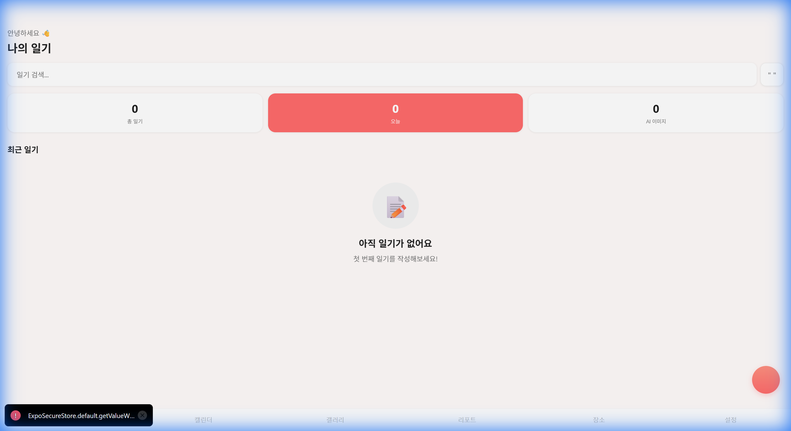
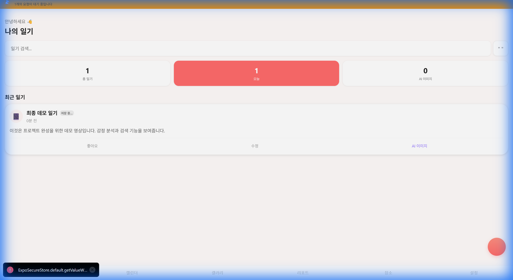
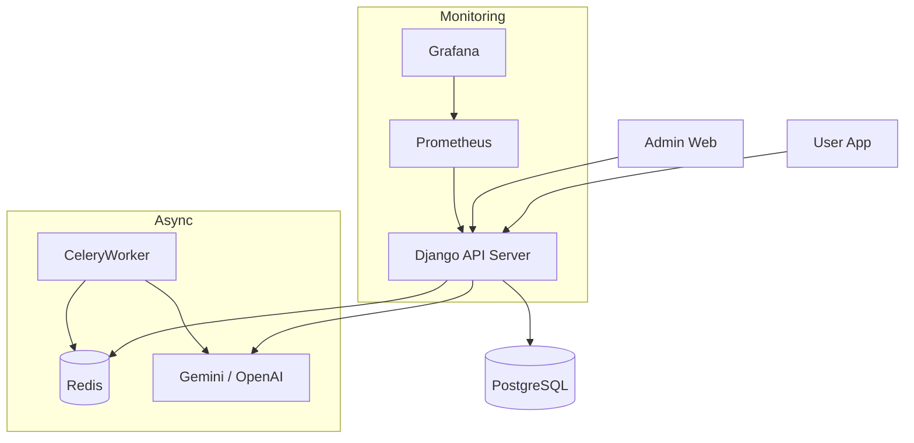

# 📔 감성 일기 (AI Emotion Diary)

> **당신의 하루를 AI가 듣고, 이해하고, 그림으로 그려줍니다.**

사용자가 작성(또는 말한) 일기를 AI가 분석하여 감정을 추출하고, 그날의 기분에 맞는 그림을 그려주는 스마트한 일기장입니다. 웹과 모바일(iOS/Android) 모두를 지원하며, 개인정보는 안전하게 암호화되어 저장됩니다.


---

## 🎬 앱 데모

프로젝트의 주요 기능을 시연하는 데모 영상입니다:


> **데모 시연 내용:**
> - ✅ 초기 화면: 빈 일기 목록 상태
> - ✅ 일기 작성: "최종 데모 일기" 제목과 내용 입력
> - ✅ 작성 완료: 목록에 새로운 일기가 정상 표시

**Before** (빈 상태):


**After** (일기 작성 후):


---

## 📸 스크린샷

### 📱 모바일 앱 (App)
| 로그인 | 홈 화면 | 캘린더 |
|:------:|:-------:|:------:|
|  |  |  |

| 갤러리 | 설정 |
|:------:|:----:|
|  |  |

### 🖥️ 관리자 대시보드 (Admin Web)
| 로그인 | 대시보드 | 모니터링 |
|:------:|:-------:|:------:|
|  |  |  |

---

## ✨ 주요 기능

### 🧠 AI 감정 분석 및 그림 생성
- **Gemini 1.5 Flash**를 활용한 8가지 핵심 감정 분석 및 점수화
- **Gemini Imagen 3** 기반의 고품질 감성 이미지 생성 (DALL-E 3 Fallback 지원)

### 🎙️ 음성 일기
- **Whisper API**를 통한 실시간 음성 녹음 및 텍스트 변환 (100+ 언어 지원)

### 📋 스마트 템플릿 & 요약
- 8가지 기본 템플릿 및 AI 맞춤형 템플릿 생성
- 긴 일기 3줄 요약 및 제목 자동 제안

### 🧠 고급 AI 기능
- **KeyBERT**: 문맥 기반 스마트 키워드/태그 추출
- **Vector Search (pgvector)**: 감정과 내용이 유사한 과거 일기 추천

### 📊 리포트 & 시각화
- 주간/월간/연간 감정 리포트 및 GitHub 스타일 히트맵
- **관리자 대시보드**: 사용자 통계, 가입 추이, 일기 작성 현황 시각화

### 🛡️ 보안 & 모니터링
- **콘텐츠 모더레이션**: AI 기반 유해성 탐지 및 자동 차단
- **시스템 모니터링**: Prometheus + Grafana를 통한 실시간 서버 상태(CPU, 메모리, 요청) 추적
- **AES-256 암호화**: 모든 일기 내용의 안전한 암호화 저장

---

## 🛠️ 기술 스택 (Tech Stack)

| 구분 | 기술 | 설명 |
|------|------|------|
| **App Frontend** | React Native (Expo SDK 52) | 크로스 플랫폼 모바일 앱 |
| **Admin Frontend** | React + Vite + MUI | 관리자용 웹 대시보드 |
| **Backend** | Django 5.x + DRF | RESTful API 서버 |
| **Database** | PostgreSQL + pgvector | 벡터 검색 지원 DB |
| **AI Models** | Gemini 1.5 Flash, Imagen 3 | 텍스트/이미지 생성 |
| **Monitoring** | Prometheus + Grafana | 시스템 메트릭 수집 및 시각화 |
| **Deploy** | Docker Compose | 컨테이너 기반 배포 환경 |

---

## 🏗️ 시스템 아키텍처

> 상세 문서는 [SYSTEM_ARCHITECTURE.md](docs/SYSTEM_ARCHITECTURE.md) 참조



---

## 🚀 시작하기

### 1. 저장소 클론
```bash
git clone https://github.com/kimmyuung/capstone-diary.git
cd capstone-diary
```

### 2. Backend 설정
```bash
cd backend
python -m venv venv
.\venv\Scripts\activate  # Windows

pip install -r requirements.txt
cp .env.example .env  # API 키 설정 필수 (GEMINI_API_KEY 등)

python manage.py migrate
python manage.py create_system_templates
python manage.py runserver
```
API 서버: `http://localhost:8000`

### 3. Frontend App (모바일)
```bash
cd frontend
npm install
npx expo start
```
- Expo Go 앱으로 QR 코드를 스캔하여 실행합니다.

### 4. Admin Web (관리자 대시보드)
```bash
cd admin-web
npm install
npm run dev
```
관리자 웹: `http://localhost:3001` (또는 5173)

### 5. Monitoring (Grafana + Prometheus)
Docker Desktop이 실행 중이어야 합니다.
```bash
# 프로젝트 루트에서
docker-compose up -d prometheus grafana
```
- Grafana: `http://localhost:3000` (ID/PW: admin/admin)
- Admin Web의 "시스템 모니터링" 메뉴에서 임베딩된 대시보드를 확인할 수 있습니다.

---

## 📡 주요 API 엔드포인트

| 구분 | Endpoint | 설명 |
|------|----------|------|
| **인증** | `/api/token/` | JWT 토큰 발급 |
| **일기** | `/api/diaries/` | 일기 CRUD |
| **AI** | `/api/generate-image/` | 이미지 생성 |
| **관리자** | `/api/admin/stats/` | 시스템 통계 |
| **모니터링** | `/metrics` | Prometheus 메트릭 노출 |

전체 API 문서는 `/api/docs/` (Swagger)에서 확인 가능합니다.

---

## 👨‍💻 개발자

**김명호** - [GitHub](https://github.com/kimmyuung)
